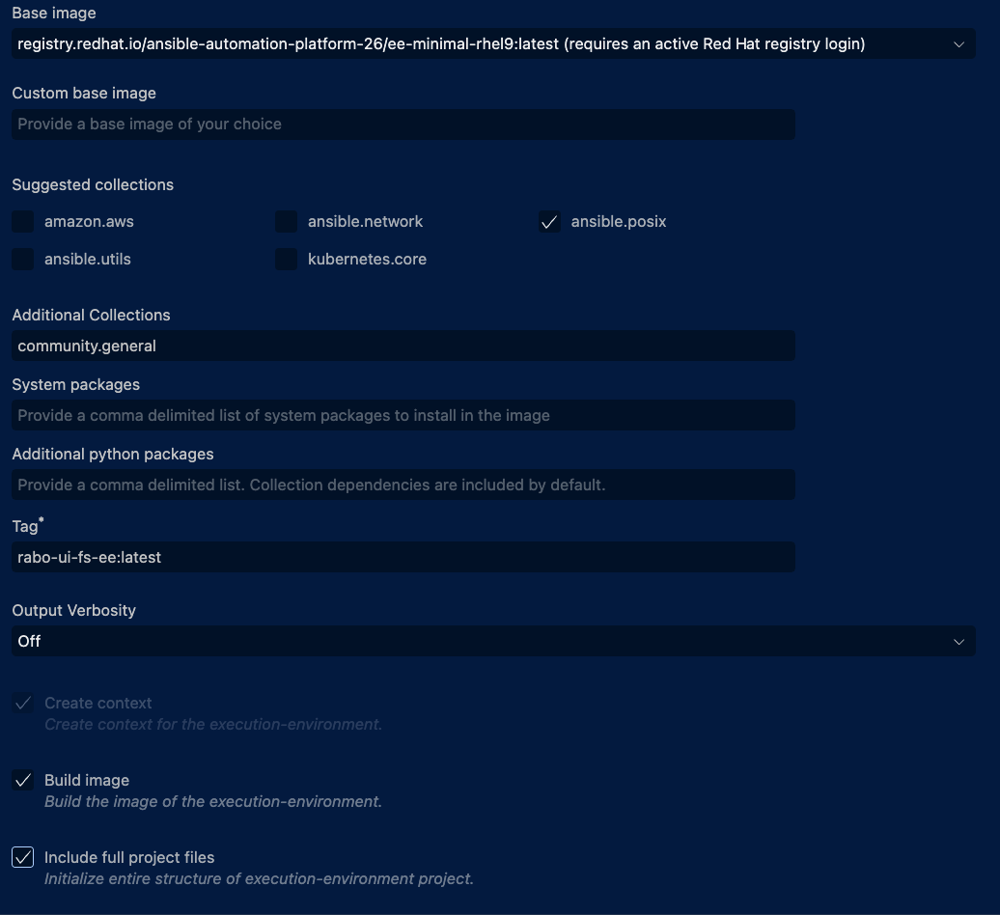

# Step 5: Creating an Execution Environment

## Objective

Build a single Execution Environment `acme-ui-fs-ee` that packages everything needed to run `acmecorp-playbook`:

| Layer | Content |
|---|---|
| Base image | `ee-minimal-rhel9` (RHEL9, `ansible-core` pre-installed) |
| Galaxy collections | `ansible.posix`, `community.general` |
| Local collection | `acme.mycollection` via tarball (`type: file`) |

## Prerequisites

- Completed Step 4 (`acme.mycollection` built and tested)
- `acmecorp-playbook` project from Steps 2–4
- Podman available (`podman --version`)
- `ansible-builder` available (`ansible-builder --version`)
- Authenticated to the Red Hat registry (required to pull the RHEL9 base image)

### Authenticating to registry.redhat.io

`registry.redhat.io` requires a Red Hat account with an active subscription or a free Developer subscription. There are two ways to authenticate:

#### Option A — Registry service account (recommended)

Registry service accounts are token-based credentials separate from your portal password and are the most reliable method:

1. Go to [https://access.redhat.com/terms-based-registry/](https://access.redhat.com/terms-based-registry/)
2. Click **New Service Account**
3. Give it a name (e.g. `devspaces-workshop`) and click **Create**
4. On the next screen click the **Docker Login** tab — it shows the exact `podman login` command with your token already filled in:

```bash
podman login -u='<service-account-username>' -p='<token>' registry.redhat.io
```

#### Option B — Red Hat Customer Portal credentials

```bash
podman login registry.redhat.io
```

> If you see `invalid username/password`, your account may lack the required entitlements. Use Option A instead — service account tokens bypass entitlement checks for base image pulls.

#### Pull the base image manually to verify

```bash
podman pull registry.redhat.io/ansible-automation-platform-26/ee-minimal-rhel9:latest
```

<details>
<summary>✅ Verification: login is active and image is accessible</summary>

```bash
podman login --get-login registry.redhat.io
podman images | grep ee-minimal-rhel9
```

**Expected:** your username printed, and the image listed locally.

</details>

---

## Step 5.1: What is an Execution Environment?

An **Execution Environment** is a container image that packages everything Ansible needs to run a job:

| Layer | What it contains |
|---|---|
| Base image | RHEL UBI + Python + `ansible-core` |
| Collections | `acme.mycollection`, `ansible.posix`, `community.general` |
| Python packages | Any pip requirements of those collections |
| System packages | OS-level libraries |

When Ansible Automation Platform (AAP) runs a job, it launches this container. Every operator, every developer, every CI run gets the exact same environment — no "works on my machine" problems.

The EE project is defined by four files:

| File | Purpose |
|---|---|
| `execution-environment.yml` | Top-level EE definition (base image, deps, build args) |
| `requirements.yml` | Ansible collections to bake into the image |
| `bindep.txt` | OS packages to install at image build time |
| `requirements.txt` | Extra Python packages (leave empty if none needed) |

<details>
<summary>✅ Verification: ansible-builder available</summary>

```bash
ansible-builder --version
```

</details>

---

## Step 5.2: Scaffold the EE project with `ansible-creator`

> **Note:** Both approaches below are broken in the version of Dev Spaces used in this workshop. They are kept here as reference so you know what to expect once the image is updated. **Skip to Step 5.3** for the working approach.

### VS Code extension



1. Click the **Ansible extension icon** in the left sidebar
2. Under **INITIALIZE**, click **Ansible Builder project** (or **Execution Environment**)
3. Fill in the form:

| Field | Value |
|---|---|
| **Destination directory** | `/projects/ansible-dev-tools-workspace/acme-ui-fs-ee` |
| Base image | `registry.redhat.io/ansible-automation-platform-26/ee-minimal-rhel9:latest` |
| Suggested collections | ✅ `ansible.posix` |
| Additional Collections | `community.general` |
| Tag | `acme-ui-fs-ee:latest` |
| ✅ Overwrite | checked |
| ✅ Include full project files | checked |

4. Click **Create**

**Why it doesn't work yet:** the extension does not pass the form values to `ansible-creator`. The generated `execution-environment.yml` is always a Fedora-based sample template regardless of what you select. This is a known bug in the bundled extension version.

### `ansible-creator` CLI

```bash
ansible-creator init execution_env \
  --ee-base-image registry.redhat.io/ansible-automation-platform-26/ee-minimal-rhel9:latest \
  --ee-collections ansible.posix \
  --ee-collections community.general \
  /projects/ansible-dev-tools-workspace/acme-ui-fs-ee
```

> If this fails with `unrecognized arguments`, check your version: `ansible-creator --version`. The `--ee-base-image` and `--ee-collections` flags require **26.x or later**.

---

## Step 5.3: Verify the scaffolded project

```bash
ls /projects/ansible-dev-tools-workspace/acme-ui-fs-ee/
```

**Expected:** `ansible-creator` generates a ready-to-build structure:
```
execution-environment.yml
requirements.txt
requirements.yml
```

---

## Step 5.4: Build the `acme.mycollection` tarball

The collection is not yet published to Ansible Galaxy, so it must be packaged as a tarball and placed in the EE project directory before the build:

```bash
cd /projects/ansible-dev-tools-workspace/acme.mycollection
ansible-galaxy collection build \
  --output-path /projects/ansible-dev-tools-workspace/acme-ui-fs-ee/
```

<details>
<summary>✅ Verification: Tarball created</summary>

```bash
ls /projects/ansible-dev-tools-workspace/acme-ui-fs-ee/acme-mycollection-1.0.0.tar.gz
```

**Expected:** the file exists. Only continue to the next step once this passes.

</details>

---

## Step 5.5: Define `execution-environment.yml`

Create `/projects/ansible-dev-tools-workspace/acme-ui-fs-ee/execution-environment.yml`:

```yaml
---
version: 3

images:
  base_image:
    name: registry.redhat.io/ansible-automation-platform-26/ee-minimal-rhel9:latest

dependencies:
  galaxy: requirements.yml
  python: requirements.txt
  system: bindep.txt

additional_build_files:
  - src: acme-mycollection-1.0.0.tar.gz
    dest: collection_tarballs

options:
  package_manager_path: /usr/bin/microdnf
```

`additional_build_files` copies the tarball into a `collection_tarballs/` directory inside the build context, where `requirements.yml` will reference it with `type: file`.

> **Why RHEL9?** `ee-minimal-rhel9:latest` is the supported base for AAP 2.6 — security-patched, minimal, and uses `microdnf`. This matches what Automation Platform runs in production.

> `build_arg_defaults.ANSIBLE_GALAXY_SERVER_URL` was valid in EE schema v1/v2 but is **not allowed in v3**. Omit it entirely for public Galaxy.

---

## Step 5.6: Define `requirements.yml`

Create `/projects/ansible-dev-tools-workspace/acme-ui-fs-ee/requirements.yml`:

```yaml
---
collections:
  - name: ansible.posix
    version: ">=1.5.0"
  - name: community.general
    version: ">=8.0.0"
  - name: collection_tarballs/acme-mycollection-1.0.0.tar.gz
    type: file
```

The `type: file` entry tells `ansible-galaxy` to install from the tarball path relative to the build context rather than fetching from Galaxy.

---

## Step 5.7: Create placeholder files

`ansible-builder` requires all files referenced in `execution-environment.yml` to exist, even if empty.

Create `/projects/ansible-dev-tools-workspace/acme-ui-fs-ee/requirements.txt`:

```
# No additional Python requirements
```

Create `/projects/ansible-dev-tools-workspace/acme-ui-fs-ee/bindep.txt` — **leave it completely empty** (zero bytes, no comments):

```bash
touch /projects/ansible-dev-tools-workspace/acme-ui-fs-ee/bindep.txt
```

> **`bindep.txt` must be a zero-byte file.** If it contains anything — even a comment — `bindep` outputs its internal `quit` token which the assemble script tries to install as a literal OS package, failing with `No package matches 'quit'`. Use `touch` to create it empty.

---

## Step 5.8: Preview the Containerfile (dry run)

Generate the build context without building the image to inspect what `ansible-builder` will produce:

```bash
cd /projects/ansible-dev-tools-workspace/acme-ui-fs-ee
ansible-builder create
cat context/Containerfile | head -60
```

You will see three stages: **Galaxy** (collection install), **Builder** (Python packages), **Final** (assembled image).

---

## Step 5.9: Build the EE

```bash
cd /projects/ansible-dev-tools-workspace/acme-ui-fs-ee
ansible-builder build \
  --tag localhost/acme-ui-fs-ee:latest \
  --container-runtime podman \
  -v 2
```

The `-v 2` flag shows each build stage. Watch the Galaxy stage — it should show all three collections being installed.

> **Dev Spaces — use `localhost/` prefix.** `ansible-builder` stores images under `localhost/`. The `podman run` wrapper (kubedock) cannot find locally built images; use `podman unshare` + `podman image mount` to inspect them instead (see verification below).

---

## Step 5.10: Verify the EE

Confirm the image was built:

```bash
podman images localhost/acme-ui-fs-ee:latest
```

Inspect the baked-in collections by mounting the image filesystem — no container runtime needed:

```bash
podman unshare bash -c "
  MNT=\$(podman image mount localhost/acme-ui-fs-ee:latest)
  echo '--- namespaces ---'
  ls \$MNT/usr/share/ansible/collections/ansible_collections/
  echo '--- acme.mycollection ---'
  ls \$MNT/usr/share/ansible/collections/ansible_collections/acme/
  podman image umount localhost/acme-ui-fs-ee:latest
"
```

> `podman unshare` enters a user namespace where the overlay mount is accessible. `podman image mount` mounts the image filesystem read-only without creating a container, avoiding all network and `/proc` issues in Dev Spaces.

<details>
<summary>✅ Expected output</summary>

```
--- namespaces ---
ansible/        ← ansible.posix
community/      ← community.general
acme/         ← acme.mycollection
--- acme.mycollection ---
mycollection/
```

</details>

---

## Step 5.11: Run the playbook

### Dev Spaces limitation — `ansible-navigator` cannot use locally built EEs

`ansible-navigator` routes container execution through kubedock (a Kubernetes-backed runtime). Kubedock tries to pull the image from a registry — `localhost/acme-ui-fs-ee:latest` only exists in local podman storage, so the pull fails. `podman.orig run` is the alternative, but OpenShift's read-only `/proc` blocks it too.

To actually use the EE with `ansible-navigator` in a real environment (outside Dev Spaces), the command is:

```bash
# Works outside Dev Spaces, or after pushing the image to a registry
ansible-navigator run \
  /projects/ansible-dev-tools-workspace/site.yml \
  --execution-environment-image localhost/acme-ui-fs-ee:latest \
  --pull-policy never \
  --mode stdout \
  -i /projects/ansible-dev-tools-workspace/inventory/
```

### Workaround — run with `ansible-playbook` directly

The collection is already installed locally from Step 4. Run the playbook without an EE:

```bash
cd /projects/ansible-dev-tools-workspace
ansible-playbook -i inventory/ site.yml
```

<details>
<summary>✅ Verification: Playbook runs successfully</summary>

**Expected output:**
```
PLAY [Set up development workspace] *******************************************

TASK [Gathering Facts] ********************************************************
ok: [localhost]

TASK [acme.mycollection.role_acmecorp_setup : Create workspace base directory] **
ok: [localhost]

TASK [acme.mycollection.role_acmecorp_setup : Create workspace subdirectories] **
ok: [localhost] => (item=projects)
ok: [localhost] => (item=logs)
ok: [localhost] => (item=configs)

TASK [acme.mycollection.role_acmecorp_setup : Create default configuration file] **
ok: [localhost]

TASK [acme.mycollection.role_acmecorp_setup : Report acmecorp status] **********
ok: [localhost] => {
    "msg": "Acmespace ready at /tmp/acme-workspace"
}

PLAY RECAP ********************************************************************
localhost : ok=5  changed=0  unreachable=0  failed=0
```

The EE was already validated in Step 5.10 via `podman unshare` — all three collections are baked in. Running with `ansible-navigator` and a pushed image in a real AAP environment would produce identical output.

</details>

---

## Bonus: Push `acme-ui-fs-ee` to Quay.io and run with `ansible-navigator`

> **Prerequisites:** A [Quay.io](https://quay.io) account. This exercise requires internet access and a Red Hat or GitHub login for Quay.io.

In Step 5.11 we couldn't use `ansible-navigator` with the locally built EE because kubedock can't find images in the local podman store. The fix is to push `acme-ui-fs-ee` to Quay.io so kubedock can pull it like any other registry image.

### B.1: Login to Quay.io

```bash
podman login quay.io
```

Enter your Quay.io username and password (or access token).

### B.2: Tag the image for your Quay.io namespace

```bash
podman tag localhost/acme-ui-fs-ee:latest \
  quay.io/<your-quay-username>/acme-ui-fs-ee:latest
```

Replace `<your-quay-username>` with your actual Quay.io username.

### B.3: Push the image

```bash
podman push quay.io/<your-quay-username>/acme-ui-fs-ee:latest
```

<details>
<summary>✅ Verification: Image visible on Quay.io</summary>

Open `https://quay.io/repository/<your-quay-username>/acme-ui-fs-ee` in a browser. You should see the pushed tag listed.

Or confirm from the CLI:

```bash
podman search quay.io/<your-quay-username>/acme-ui-fs-ee
```

</details>

> **Make the repository public — this is required.** Kubedock runs in the OpenShift cluster and has no credentials to pull private images. Without this step `ansible-navigator` will fail with `error pulling image`.
>
> Quay.io → `https://quay.io/repository/<your-username>/acme-ui-fs-ee` → **Settings** → **Repository Visibility** → **Make Public** → confirm.

### B.4: Run the playbook with `ansible-navigator`

Now that the image is in a real registry, `ansible-navigator` (via kubedock) can pull and run it:

```bash
ansible-navigator run \
  /projects/ansible-dev-tools-workspace/acmecorp-playbook/site.yml \
  --execution-environment-image quay.io/<your-quay-username>/acme-ui-fs-ee:latest \
  --pull-policy missing \
  --mode stdout \
  -i /projects/ansible-dev-tools-workspace/acmecorp-playbook/inventory/
```

`--pull-policy missing` pulls the image only if it is not already cached, avoiding unnecessary re-downloads.

<details>
<summary>✅ Verification: Playbook runs inside the EE</summary>

**Expected output:**
```
PLAY [Set up development workspace] *******************************************

TASK [Gathering Facts] ********************************************************
ok: [localhost]

TASK [acme.mycollection.role_acmecorp_setup : Create workspace base directory] **
ok: [localhost]

TASK [acme.mycollection.role_acmecorp_setup : Create workspace subdirectories] **
ok: [localhost] => (item=projects)
ok: [localhost] => (item=logs)
ok: [localhost] => (item=configs)

TASK [acme.mycollection.role_acmecorp_setup : Create default configuration file] **
ok: [localhost]

TASK [acme.mycollection.role_acmecorp_setup : Report acmecorp status] **********
ok: [localhost] => {
    "msg": "Acmespace ready at /tmp/acme-workspace"
}

PLAY RECAP ********************************************************************
localhost : ok=5  changed=0  unreachable=0  failed=0
```

The playbook runs inside the EE pulled from Quay.io — fully reproducible and portable.

</details>

### B.5: Lifecycle summary

**develop locally → build EE → verify with `podman unshare` → push to registry → run with `ansible-navigator`**

This is the real production workflow: EEs are built locally or in CI, pushed to a registry, and consumed by Ansible Automation Platform or `ansible-navigator`.

---

## Summary

You have successfully:

1. Understood the four files that define an EE
2. Packaged `acme.mycollection` as a tarball for use in the build context
3. Defined `execution-environment.yml` with RHEL9 base, Galaxy collections, and a local tarball
4. Built `acme-ui-fs-ee` with `ansible-builder`
5. Verified baked-in collections using `podman unshare` + `podman image mount`
6. Run `acmecorp-playbook` inside the EE with `ansible-navigator`
7. _(Bonus)_ Pushed `acme-ui-fs-ee` to Quay.io and ran `acmecorp-playbook` with `ansible-navigator` using the registry image

## EE project structure

```
acme-ui-fs-ee/
├── context/                              ← generated build context
│   └── Containerfile                     ← multi-stage build
├── execution-environment.yml             ← EE definition
├── requirements.yml                      ← ansible.posix + community.general + tarball
├── requirements.txt                      ← Python packages (empty)
├── bindep.txt                            ← OS packages (empty)
└── acme-mycollection-1.0.0.tar.gz      ← local collection tarball
```

## Next Step

Proceed to [Module 3: Molecule](../../03-molecule/) to write automated tests for the role inside the collection.

## References

- [ansible-builder Documentation](https://ansible.readthedocs.io/projects/builder/)
- [Execution Environment Definition Reference](https://ansible.readthedocs.io/projects/builder/en/stable/definition/)
- [bindep Documentation](https://docs.opendev.org/opendev/bindep/latest/)
- [ansible-navigator Documentation](https://ansible.readthedocs.io/projects/navigator/)
- [Red Hat EE base images](https://catalog.redhat.com/software/containers/search?q=ee-minimal)
- [Quay.io getting started](https://docs.quay.io/solution/getting-started.html)
